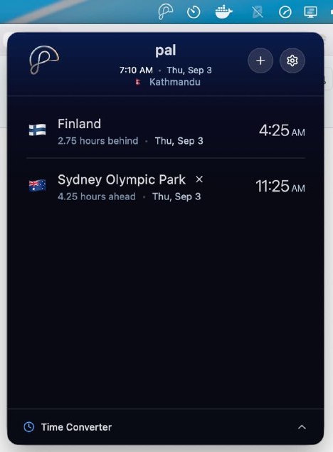

<p align="center"> 

</p>

<div align="center">
<a href="https://apps.microsoft.com/detail/9pdqpbgn6d3t" target="_blank">
  
</a>
</div>

# pal

pal (पल), Nepali for “a moment in time”. Pronounced simply “pal.”

Pal is a simple system tray app for keeping track of time across the world.

Add the cities and locations that matter to you and see their local times at a glance. Pal also makes it easy to answer everyday timezone questions:

> “When it’s 4 PM in Tokyo, what time is it in Kathmandu?”

With pal, you can quickly compare locations and find the corresponding time in another part of the world without doing the math.

Whether you work with people around the world, have friends and family in different time zones, or simply want an easier way to keep track of global time, pal helps you stay in sync with every moment, wherever it happens.



## Getting Started

### Installation

1. Download the latest [release](https://github.com/sndsabin/pal/releases) of pal for your operating system.
2. Launch the application.
3. Select a service, choose a version, and start it.

> ## ⚠️ First-Launch Security Warnings (Unsigned Release)
>
> Because current releases are unsigned, your operating system might show a security warning when opening the application for the first time.
>
> ---
>
> ### macOS (`.dmg`)
>
> macOS may block the app with a message stating it _“cannot be opened because it is from an unidentified developer.”_
>
> **How to run:**
>
> 1. Open **System Settings** $\rightarrow$ **Privacy & Security**.
> 2. Scroll down to the **Security** section.
> 3. Locate the notification for `pal` and click **Open Anyway**.
> 4. Enter your system password or use Touch ID to confirm.
>
> **Official Apple Guide:** [Open a Mac app from an unidentified developer](https://support.apple.com/guide/mac-help/open-a-mac-app-from-an-unidentified-developer-mh40616/mac)

## Tech Stack

pal is built with:

- [Go](https://go.dev/)
- [TypeScript](https://www.typescriptlang.org/)
- [React](https://react.dev/)
- [Tailwind CSS](https://tailwindcss.com/)
- [Vite](https://vitejs.dev/)
- [Wails v3](https://wails.io/)

## Local Development

### Clone the repository

```bash
git clone https://github.com/sndsabin/pal
cd pal
```

### Run the application

```bash
make dev
```

This starts the application in development mode with live reloading for both the Go backend and the frontend.

### Build commands

```bash
# Build app for Windows
make build-windows

# Build app for Linux
make build-linux

# Build app for macOS
make build-mac
```

## Contributing

Contributions, feature requests, and bug reports are welcome. Feel free to open an issue or submit a pull request.

## License

See the `LICENSE` file for details.

---

## Inspiration

pal is inspired by [meanwhile](https://github.com/sangamdai/meanwhile).
